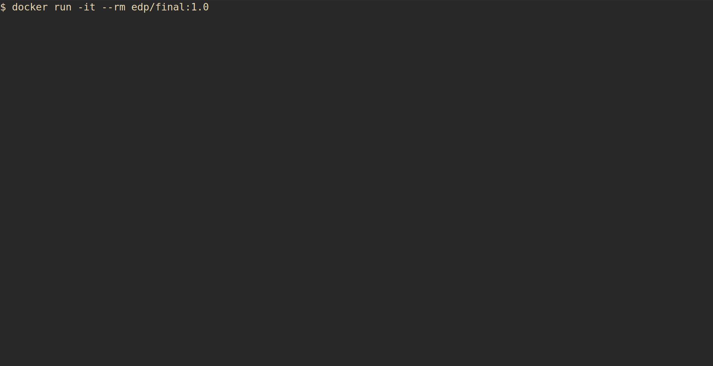

# Trabajo práctico final

### Integrantes
- Garay Gorta, Isaías
- Leguiza, Claudia
- Lo Celso, Marcelo

## Requisitos

* SSH, para clonar el repositorio.
* Docker, para crear y correr la imagen.

## Documentación

1. Clonar el repositorio con el comando `$ git clone git@github.com:Isaiasgaray/edp_final.git`
2. Entrar al directorio del repositorio.
3. Ejecutar el comando `$ docker build --tag edp/final:1.0 .`
4. Ejecutar la imagen generada con `$ docker run -it --rm edp/final:1.0`

Una vez dentro del contenedor se desplegará un menu con el que seleccionar la 
mini-aplicación para análisis de texto. Si el texto no contiene los criterios de
búsqueda del script seleccionado, entonces no se imprimirá nada en pantalla.
Si las opciones del menu se van de la vista, se pueden recuperar presionando enter
con una entrada vacía.

El texto por defecto a analizar es `zen.txt` y se encuentra en el directorio 
`archivos_de_prueba`. Para analizar otro texto primero hay que copiarlo al
directorio `archivos_de_prueba` y luego correr el siguiente comando 
`sed -i 's/zen.txt/nombrearchivo.txt/ Dockerfile'` en el directorio 
`edp_final`.

## Ejemplos de uso

